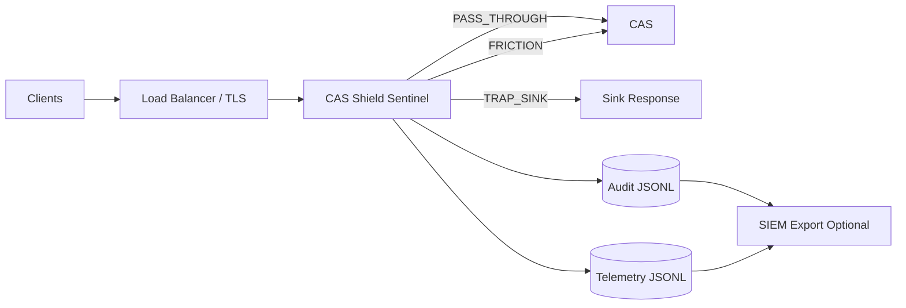

# CAS Shield Sentinel Playbook
Version: 1.1  
Classification: Defensive Security Architecture  
Deployment Model: Sidecar Plugin (Non-Intrusive)  
Target System: CAS Authentication Infrastructure  

------------------------------------------------------------

## 1. Executive Summary

CAS Shield Sentinel is a defensive authentication protection layer deployed as a sidecar reverse proxy in front of a Central Authentication Service (CAS).

It provides five defensive functions:

1. Authentication traffic classification  
2. Adaptive defensive friction  
3. Attack diversion and sink containment  
4. Trace correlation through Pebbles in My Pocket  
5. Automated blocking escalation through Stonewall  

CAS remains the system of record. The shield does not modify CAS.

Safety constraints enforced by design:

- No decoy login forms  
- No credential harvesting  
- No password parsing  
- No request body storage  
- TRAP_SINK never forwards upstream  

------------------------------------------------------------

## 2. System Design

### 2.1 Architecture Summary

The shield sits between clients and CAS, deciding one of three paths per request:

- PASS_THROUGH: forward immediately  
- FRICTION: delay then forward  
- TRAP_SINK: tarpit + deny, never forward  

### 2.2 Data Flow

1. Request enters sidecar  
2. Rate limiter evaluates rate pressure  
3. Risk scorer computes score and reasons  
4. Pebbles creates trace identifiers for correlation  
5. Mystique adjusts defensive knobs per campaign (bounded)  
6. Router applies PASS_THROUGH, FRICTION, or TRAP_SINK  
7. Logs written: audit.jsonl (all), telemetry.jsonl (sink events)  
8. Optional export to SIEM (not enabled in this bundle)  

### 2.3 Full Vectoring

Inputs (per request)

- Source IP (and X-Forwarded-For if present)  
- HTTP method, path, query string  
- Header fingerprint fields (User-Agent, Accept, Accept-Language, Accept-Encoding)  
- Rate pressure signals: token bucket failures per IP and per IP+path  
- Upstream health status from periodic health check  

Feature vectors and derived indicators

- Fingerprint ID: stable hash of selected headers  
- Campaign ID: time-windowed hash of salt + bucket + ip + fingerprint + path prefix  
- Risk reasons: categorical flags (bad_user_agent, missing_headers, rate_pressure, suspicious_path)  
- Route decision: PASS_THROUGH | FRICTION | TRAP_SINK  
- Latency buckets: implied via applied delays and upstream response latency  

Outputs

- Audit ledger event (append-only JSONL)  
- Telemetry event for TRAP_SINK and canary hits (append-only JSONL)  
- Stonewall state changes (banlist, blocklist) observable via /__shield/status  

------------------------------------------------------------

## 3. Component Model

### 3.1 Edge Proxy

- Receives inbound HTTP  
- Forwards to CAS only in PASS_THROUGH and FRICTION paths  
- Normalizes host header handling  

### 3.2 Risk Scorer

Deterministic weighted scoring with reasons.

Signals:

- Suspicious path prefixes (.env, wp-admin, etc.)  
- Missing or low-quality User-Agent  
- Missing Accept / Accept-Language  
- Rate pressure conditions (token bucket failures)  
- Allowlist and blocklist overrides  

### 3.3 Rate Limiter

Token buckets:

- Per IP  
- Per IP + path  

Used to increase risk score via rate_pressure and, indirectly, to drive routing decisions.

### 3.4 Pebbles in My Pocket

Trace identifiers written for correlation:

- trace_id: request UUID  
- fingerprint_id: hash of selected headers  
- campaign_id: time-windowed campaign correlation key  

Optional echo header:

- X-Pebble-Trace is returned on FRICTION and TRAP_SINK (configurable)  

### 3.5 Mystique Mode

Mystique never interacts with attackers. It only adapts defense parameters using observed telemetry.

It adjusts, per campaign:

- friction_multiplier  
- tarpit_multiplier  
- sink_score_override (bounded floor)  

Trigger conditions:

- campaign_promote_threshold: minimum events before adaptation  
- adapt_every_n_events: periodic adaptation cadence  
- trap_ratio threshold: only when campaign shows strong malicious profile  

### 3.6 TRAP_SINK Containment

TRAP_SINK:

- Applies tarpit delay  
- Returns 403  
- Never calls upstream forward function  
- Writes telemetry entry  

### 3.7 Stonewall Escalation

Escalation logic (per campaign):

- repeat_threshold: triggers ban_seconds_first  
- repeated thresholds trigger ban_seconds_repeat  
- trap_hits_to_blocklist triggers adding IP to in-memory blocklist  

This is edge-only enforcement.

------------------------------------------------------------

## 4. Operational Procedures

### 4.1 Normal Operations

- Keep sidecar running in front of CAS  
- Monitor /__shield/status for upstream health and counters  
- Ship logs from ./logs to SIEM if required  

### 4.2 Response Procedure

When campaigns appear in logs:

1. Pivot by campaign_id in audit.jsonl and telemetry.jsonl  
2. Confirm the routes, reasons, and timestamps  
3. Identify top paths, IPs, and fingerprints for the campaign  
4. Increase enforcement by adding IPs to blocklist or updating WAF rules externally  
5. Retain evidence: export matching JSONL slices and hash them for chain-of-custody  

### 4.3 Investigation Workflow

Primary keys:

- campaign_id  
- fingerprint_id  
- ip  

Workflow:

1. Identify high-rate TRAP_SINK bursts in telemetry.jsonl  
2. Group by campaign_id to detect coordinated attacks  
3. Compare fingerprints across IP changes to identify distributed tools  
4. Validate whether any suspicious traffic reached CAS by comparing CAS logs to PASS_THROUGH or FRICTION events  
5. Produce timeline report:
   - first_seen  
   - last_seen  
   - routes count  
   - top paths  
   - enforcement actions taken  

------------------------------------------------------------

## 5. Expected Behaviour Tests

These map directly to the implementation in this bundle.

### 5.1 FRICTION: delay applied then forward, audit includes reasons

Trigger:

- Missing headers or bot-like User-Agent  
- High rate pressure  

Expected:

- route=FRICTION  
- audit event includes reasons and delay_ms  
- request forwarded upstream successfully  

### 5.2 TRAP_SINK: probes to /.env or /wp-admin

Trigger:

- suspicious_path rule  

Expected:

- route=TRAP_SINK  
- response 403 with tarpit delay  
- telemetry event written  
- upstream not called  

### 5.3 Repeat trap hits: stonewall escalation

Trigger:

- repeated TRAP_SINK events for same campaign  

Expected:

- banlist_size increases in /__shield/status  
- blocklist_size increases after trap threshold  
- subsequent requests may be denied immediately  

### 5.4 Upstream health down: 503 and circuit breaker

Trigger:

- CAS health endpoint fails  

Expected:

- response 503  
- audit reason upstream_unhealthy_or_circuit_open  
- /__shield/status shows upstream_healthy false or circuit_open true  

------------------------------------------------------------

## 6. Self-Check Assertions

All must remain true:

- The code never renders a login form  
- The code never stores request bodies  
- The code only reads bodies when forwarding to CAS  
- The trap path does not forward upstream  

You can verify:

- Only forward_to_cas reads req.body  
- TRAP_SINK and canary paths do not call forward_to_cas  
- Responses from the sidecar are either:
  - upstream CAS responses
  - PlainText 403 / 503
  - 204 for canary hits  

------------------------------------------------------------

## 7. Deployment Architecture

### 7.1 Production Topology

Recommended:

- External load balancer terminates TLS  
- Sidecar runs as an internal service  
- CAS behind it on private network  

ASCII diagram:

```
Internet
  |
[LB / TLS]
  |
  v
[CAS Shield Sentinel]  -> logs -> SIEM (optional)
  |
  v
[CAS]
```

Mermaid diagram (for markdown renderers that support it):



### 7.2 Sidecar Compatibility

- Works with any CAS deployment that can be reached via HTTP(S) upstream  
- No CAS code changes  
- No schema changes  
- No directory integration changes  

------------------------------------------------------------

## 8. Deployment Bundle Contents

This bundle includes:

- Dockerfile for the sidecar  
- docker-compose.yml for sidecar + optional demo upstream  
- src/cas_shield_sidecar.py  
- config/cas_shield_config.json  
- scripts/smoke_test.sh and scripts/smoke_test.py  

------------------------------------------------------------

## 9. Quick Start

### 9.1 Run with Docker Compose (recommended)

1. Set environment variables (example):

- CAS_BASE_URL points to your CAS upstream  
- PEBBLES_SALT must be a long random string  

2. Start:

- docker compose up --build

3. Check status:

- GET http://localhost:8080/__shield/status

### 9.2 Run locally without containers

pip install fastapi uvicorn httpx requests

export CAS_SHIELD_CONFIG=./config/cas_shield_config.json  
export CAS_BASE_URL=http://127.0.0.1:9090  
export PEBBLES_SALT=long_random_value  

python src/cas_shield_sidecar.py

------------------------------------------------------------

## 10. Evidence Handling

If you need audit-ready artefacts:

- Retain the relevant slice of audit.jsonl and telemetry.jsonl  
- Produce a hash of the slice and store with timestamp  
- Document enforcement actions:
  - bans applied
  - IPs moved to blocklist  
- Store /__shield/status output at time of incident  

------------------------------------------------------------

END OF PLAYBOOK
